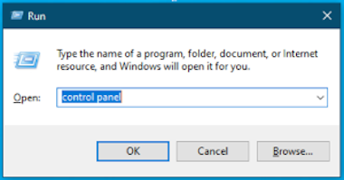
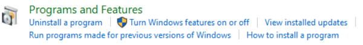
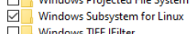
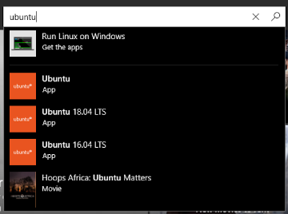
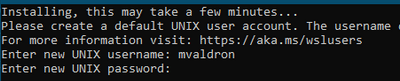
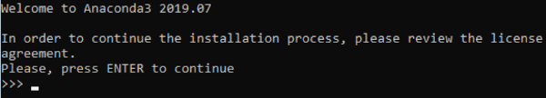
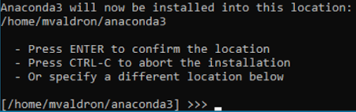
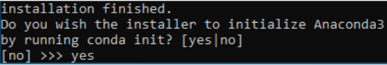

# Clojure Environment Setup

This guide goes over how to set up your Clojure environment for this year's course. Follow these steps carefully, and you will be set for all the activities coding in Clojure. You can access the slides [here](https://docs.google.com/presentation/d/1TK3bQAyY2JUKf6q-tOQp8jzWrwSVu-e-MmXIEJKBO-4/edit?usp=sharing). If further assistance or clarification is required to email Michael Valdron at [michael.valdron@ontariotechu.net](mailto:michael.valdron@ontariotechu.net).

## Table of Contents

1. [Requirements](#requirements)
    1. [Summary](#summary)
    2. [Windows Subsystem for Linux](#windows-subsystem-for-linux-recommended)
    3. [Java JDK](#java-jdk)
    4. [Python 3 with Jupyter](#python-3-with-jupyter)
2. [Clojure 1.10.1](#clojure-1101)
    1. [rlwrap (Optional)](#rlwrap-optional)
3. [Clojupyter](#clojupyter)

## Requirements

### Summary

- Supported Operating Systems: Windows (Subsystem for Linux) and Ubuntu 18.04 LTS (and flavours)
- Java JDK 1.8+
- Anaconda (Python 3 Edition)
- Jupyter Notebook or Jupyter Lab

### Windows Subsystem for Linux (Recommended)

For this years course, we are supporting Windows users who use the Windows Subsystem for Linux with the Ubuntu 18.04 kernel as well as those who use the Ubuntu 18.04 Linux distribution. If you use Ubuntu 18.04 distribution, you can skip this subsection.

If you are using Windows with the Windows Subsystem for Linux, follow these steps:

1. Hold windows-r, type "control panel", and press enter



2. Click Programs
3. Under the Programs and Features link there is a collection of smaller links, click "Turn Windows features on or off"



4. In the list which comes up, make sure "Windows Subsystem for Linux" is checked off, then click ok



5. If it was not checked to begin with you will need to reboot your system to continue, if it was already checked off you could proceed to the next step
6. Open the Windows Store, search "ubuntu", in the results which come up click "Ubuntu 18.04 LTS"



7. If the install option is shown, click it to install the Subsystem kernel, if it already shows launch this means everything is already installed and you can just skip the remaining steps
8. Once Ubuntu 18.04 LTS terminal is installed, you can find it in your start menu
9. Launching this terminal for the first time will require it to do some initializing which could take some time, during the process it will ask you for a username and password for creating your subsystem user, this user can be given the same credentials as your Windows systems credentials to make things easier however it is not the same user as your Windows user so be mindful when setting this up



10. Once the initialization is complete, you can now open the terminal to use Ubuntu under Windows!

#### Note

You can access all Windows directories within the terminal under `/mnt/<drive letter>`, e.g. to access `C:\` you look at `/mnt/c/` directory in the terminal.

### Java JDK

Clojure is a language which is built on top of Java. Therefore Clojure requires Java to run. For the current versions of Clojure, it is necessary to install at least Java JDK 1.8.0.

For those using **Ubuntu or Windows Subsystem for Linux (Ubuntu)** you can install Java using the following command:

```bash
sudo apt-get install default-jdk default-jre
```

### Python 3 with Jupyter

For this course, you will be writing Clojure in Jupyter Notebook using the "Clojupyter" kernel. To setup Clojupyter, you will first need both Python 3 and Jupyter Notebook. The steps in this section will assume you are on **Ubuntu or Windows Subsystem for Linux (Ubuntu)**.

You can setup Python 3 and Jupyter Notebook by installing Anaconda in the following steps:

1. Go to [https://www.anaconda.com/distribution/](https://www.anaconda.com/distribution/)
2. Make sure that **Linux** is selected, then click [Download](https://repo.anaconda.com/archive/Anaconda3-2019.07-Linux-x86_64.sh) under **Python 3.7 version** to download the installation script for Anaconda
3. Open the terminal and navigate to the directory you downloaded the script into
4. Run `chmod a+x ./Anaconda3-2019.07-Linux-x86_64.sh` to make the script executable
5. Run `./Anaconda3-2019.07-Linux-x86_64.sh` to run the installation of Anaconda and follow the steps



6. When it asks where to install Anaconda you can just hit enter, and it will install it to ~/anaconda3, this is fine



7. Once it is finished extracting all the base packages into the installation directory (This will take some time), type yes when prompted to init conda, this is important because it will activate the base environment by default anytime the terminal is launched which allows for anaconda commands to be accessed, if you say no you will need to manually link the desired conda binaries to the `PATH`



8. Once the installation is complete, you can now use Anaconda to install Jupyter within a Python 3 environment. Optionally you can either create an environment for this course or just use the base environment. You can create anaconda environments by running `conda create -n <env_name> python=<python_version>`, then using `conda activate <env_name>` to activate your environment. If you are going to use the base environment, skip the last step
9. Once you are in the anaconda environment of your choosing, run `conda install -c anaconda jupyter` to install Jupyter Notebook

**Note**: If you are using **Windows Subsystem for Linux** you will have to copy the URL from the console to the web browser to open Jupyter.

Clojupyter will work with all methods of setting up Python 3 and Jupyter Notebook so long as it is set up in either **Ubuntu or Windows Subsystem for Linux (Ubuntu)**. All other distributions and operating systems will not be officially supported in this course.

## Clojure 1.10.1

First, we will set up the base Clojure interpreter, which will be used to run your Clojure source code.

To install clojure on **Ubuntu or Windows Subsystem for Linux** follow the following steps from [clojure.org](https://clojure.org/guides/getting_started):

```bash
curl -O https://download.clojure.org/install/linux-install-1.10.1.469.sh
chmod +x linux-install-1.10.1.469.sh
sudo ./linux-install-1.10.1.469.sh
```

You can download the install script from [here](https://download.clojure.org/install/linux-install-1.10.1.469.sh) in case you do not have curl.

### rlwrap (Optional)

For a better interpreter experience, you can optionally install `rlwrap` under Linux or Linux Subsystem within Windows.

To install rlwrap, run this command: `sudo apt-get install rlwrap`

To use Clojure without `rlwrap` type `clojure`, to use Clojure with `rlwrap` type `clj`.

## Clojupyter

### From Provided ZIP

As of November 3, 2019, Clojupyter 0.2.3 install kernel procedure in both Anaconda and Leiningen installs are broken, making it impossible to install this version of the kernel from scratch. Because of this, we are providing a packaged kernel to those who have not completed this process earlier.

The package can be downloaded from [here](). Follow to steps below to unpackage into your environment:

1. `wget https://github.com/ontariotechu-csci3055u/course-materials-2019/raw/master/clojure-setup/downloads/kernel.zip`
2. `unzip kernel.zip`
3. `mv kernel ~/anaconda3/share/jupyter/kernels/<name>`
4. Edit `kernel.json` and fill in the appropriate information
    1. `<name>` - The name you want to give the Jupyter kernel
    2. `<path to this dir>` - The base path of the kernel directory, i.e. where your clojupyter-standalone.jar, kernel.json, and logo.png are located.

Once you have completed all these steps correctly, you should be able to use the Clojupyter 0.2.3 kernel in Jupyter Notebook and Lab.

### Anaconda

Clojupyter is an additional kernel built for Jupyter which gives Jupyter the ability to interpret Clojure code as it typically does for Python. The following steps will show how to install Clojupyter kernel into your local Jupyter.

Activate the environment you desire to use then run: `conda install -c simplect clojupyter`

Now if you run `jupyter notebook` or `jupyter lab` you will now have the option to create iPython Notebooks using the Clojupyter kernel, in other words... Clojure Notebook! :)
